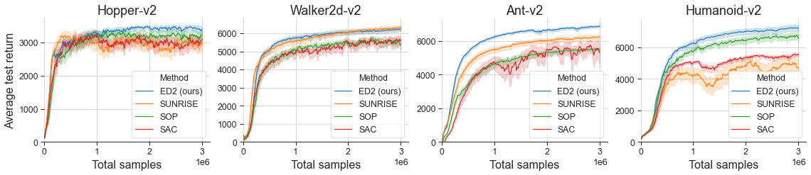

# Continuous Control With Ensemble Deep Deterministic Policy Gradients

This repository is the official implementation of Continuous Control With Ensemble Deep Deterministic Policy Gradients. 

[comment]: <> (>📋  Optional: include a graphic explaining your approach/main result, bibtex entry, link to demos, blog posts and tutorials)
 


## Requirements
Before installation, please make sure you have MuJoCo engine set up on your machine. We use mujoco150 in order to be comparable with previous benchmarks on v2 environments. See this [issue](https://github.com/openai/gym/issues/1541)

To install requirements:

```setup
pip install -r requirements.txt
```

## Training
To train the model(s) in the paper, run this command:

```train
python run.py <experiment_specification path>
```

Logger automatically stops training and evaluates current policy every `log_every` environment interactions. The data is printed to standard output and stored on drive.

We include specifications for our most important experiments.

| Path        | Description           |
| ------------- |:-------------:|
| specs/ed2_on_mujoco.py | Benchmark of our method | 
| specs/sac_on_mujoco.py | Benchmark of our implementation of SAC |
| specs/sunrise_on_mujoco.py | Benchmark of our implementation of SUNRISE |
| specc/sop_on_mujoco.py | Benchmark of our implementation of SOP |

## Results

Our model achieves the following performance on the MuJoCo suite:


